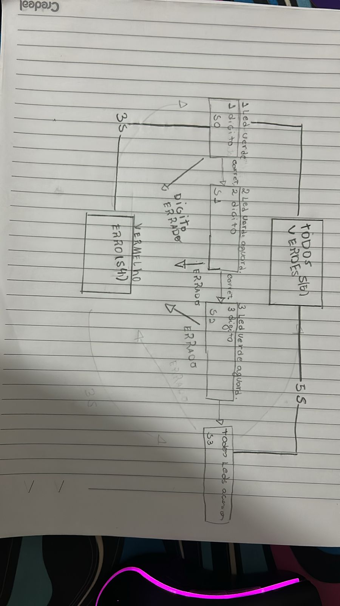

# SafeCrack FSM

## Descrição
SafeCrack FSM - FSM de um cofre digital que só é aberto quando o usuário digita a sequência correta das entradas (BTN[0] = '1', BTN[1] = '1', BTN[2] = '1').

## Diagrama da Máquina de Estados (FSM)

